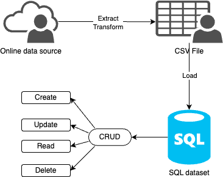

# Individual Project 2: Rust CLI Binary with SQLite Tianji Rao

## Overview 
In this project, we want to conduct data extraction, transformation, and loading with `Rust`. These operations are on a dataset and a SQLite database. A Rust CLT is built for realizing this objective. Three functions are saved in the src, each of them are used in main.rs for CTL. Using the general query function, we can further run quer
apply CRUD actions.

## Demo Video

## Workflow

## Preparation
1. Create a codespace 
2. build: `cargo build`
3. extract: `cargo run extract`
4. transform and load: `cargo run transform_load`
5. sample querys (Makefile): `make create`, `make read`, `make update`, `make delete`. 
6. query: `cargo run query <your query>`

## Format, lint, and test 
- format: `make format` 
- lint: `make lint` 
- test: `make test`

## References

* [rust-cli-template](https://github.com/kbknapp/rust-cli-template) 
* [data source](https://github.com/fivethirtyeight/data) 
* [splite](https://docs.rs/sqlite/latest/sqlite/)